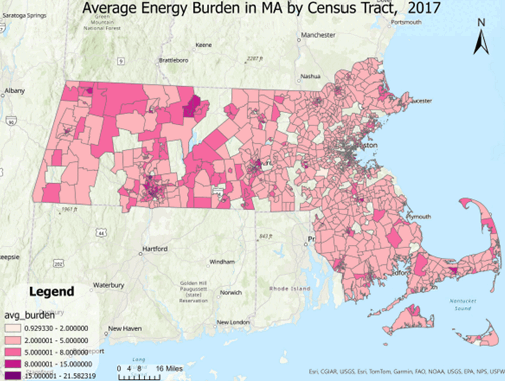

# About me
Sustainability manager and urban informatics specialist focusing on energy infrastructure, efficiency, conservation, and affordability. 

I am currently completing my MS in Urban Informatics at Northeastern University, where I developed a strong focus on exploring the concept of energy burden—the percentage of household income spent on energy costs—and its implications for urban resilience, particularly in Massachusetts and in the City of Boston.

I also currently serve as the Sustainability Manager of Harvard Medical School and the Harvard School of Dental Medicine, where I lead strategic sustainability planning, with a strong emphasis on green labs initiatives, energy and emissions data analysis, and the evaluation of procurement practices through a sustainability lens.
A significant part of my work involves conducting energy savings analyses, assessing the financial and resource impacts of projects or new equipment in laboratories, and analyzing the implications of carbon regulations and commitments on our institution. 

Through my academic and professional work, I focus on improving energy systems and building infrastructure, as well as analyzing the efficacy and impacts of carbon and energy regulations on building owners and residents. I'm passionate about leveraging data science and urban informatics to address challenges in energy affordability, community resiliency, and climate change adaptation in MA. 

Check out my resume [here](https://github.com/user-attachments/files/17281382/Baker.Resume.pdf) and some of my projects below. 

# The Energy Burden Crisis in Massachusetts

My graduate research focuses on one of the most pressing challenges facing Massachusetts residents today: energy burden. Behind the statistics and policy discussions are real people making impossible choices.

> "This is New England. It gets cold. We're cold," says Sherona Kravits. "And I work part time, and so...you know I'm thinking of getting another, going back to my other part time job which I had before covid, and so I'll have two part-time jobs. And I'll just...in order to survive."

<table>
<tr>
<td align="center"><h2 style="color: #cc0000;">64%</h2>Average monthly electricity bill increase (National Grid)</td>
<td align="center"><h2 style="color: #cc0000;">73%</h2>Increase in home heating oil costs from 2021</td>
<td align="center"><h2 style="color: #cc0000;">15%</h2>MA households facing severe energy burden</td>
</tr>
</table>

These stories from residents of Massachusetts are not isolated incidents, but rather a reflection of the hardships faced by thousands across the state. The difficulties reached a peak for some communities during the winter of 2022 when energy rates surged to historic highs due to the war in Ukraine.

Energy is a crucial source of economic and industrial growth; it is a basic and necessary input for all modern production and consumption activities in the US economy. It enables all systems to meet modern human needs -- food, shelter, employment, and transportation. However, when accessing or affording energy is challenging, it can become a financial and hazardous liability for residential customers, often referred to as "energy burden". Energy burden is a complex and compound issue used to describe the inability to afford utility costs, leading households to forgo spending in other categories, often other necessities like food, what is sometimes referred to as the "heat or eat" choice.

The tradeoffs that households face when confronting energy burden are not short term - not only do they mean forgoing spending on necessities like food, health care, shelter in the short term, they also contribute to a negative feedback loop that can trap families in an enduring cycle of poverty. When low-income families are unable to pay utility bills, and face utility shut offs and evictions, these are legal processes, associated with social security records and appearing on background checks, which can have lifelong administrative impacts on housing and employment access. They can also have impacts on access to future credit.

## Understanding the Crisis

The map above, from my most recent investigation into energy burdens, shows how they have evolved across Massachusetts from 2017 to 2022, revealing concerning trends in both magnitude and distribution.

Summing up the research I've done into this subject as a graduate student at NEU, my key findings are:

- Energy costs have risen dramatically in the past 5-8 years, with some households seeing their bills more than double
- Low-income and minority communities face disproportionate impacts
- The gap between energy-efficient and inefficient housing is continuing to grow and exacerbating the issue

## My Research

During my studies, I have examined several different dimensions of energy burden in Massachusetts. Below are three of my works that explore this critical issue:

### 🏠 Project 1: EBRS Analysis
Developed an Energy Burden Risk Score based on property characteristics to identify at-risk areas in Boston.

[View Full Project →](project1.html)

### 🗺️ Project 2: Spatial Patterns
Mapped energy burden distribution across Boston to identify areas needing increased efficiency programs.

[View Full Project →](project2.html)

### 📈 Project 3: Urban Resilience
Analyzed energy burden evolution from 2017-2022, revealing concerning trends in magnitude and distribution.

[View Full Project →](project3.html)

